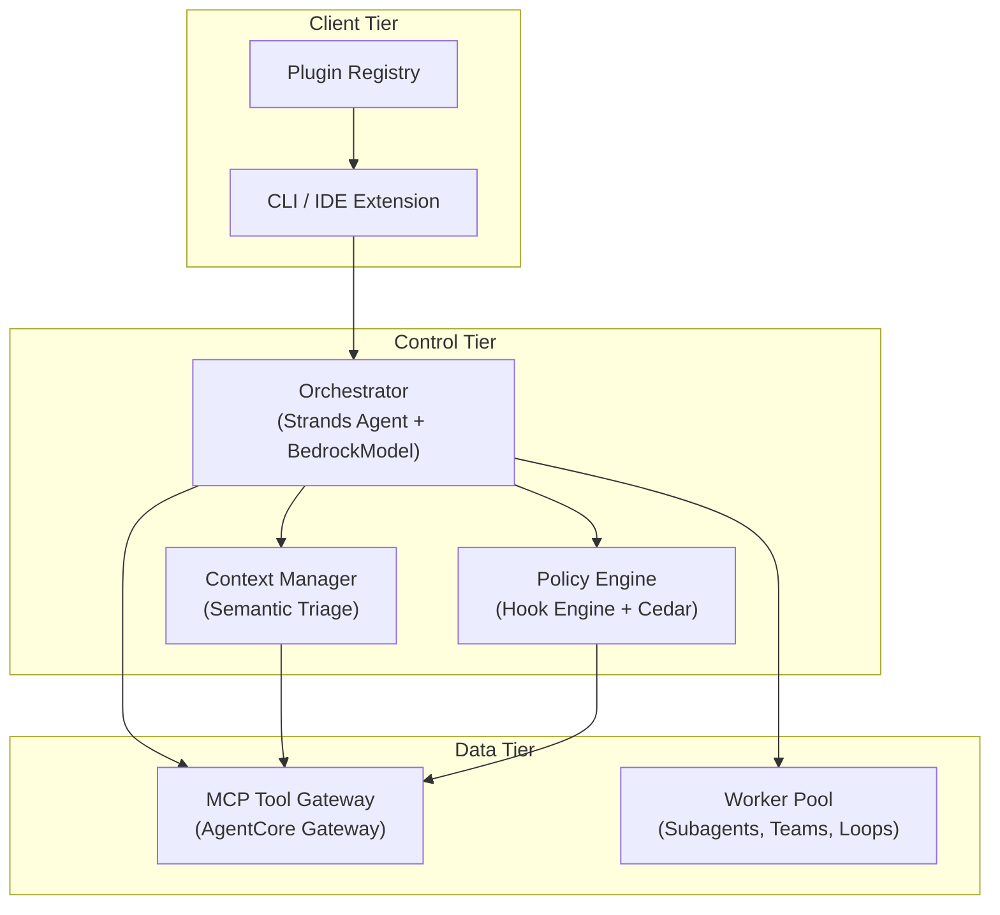
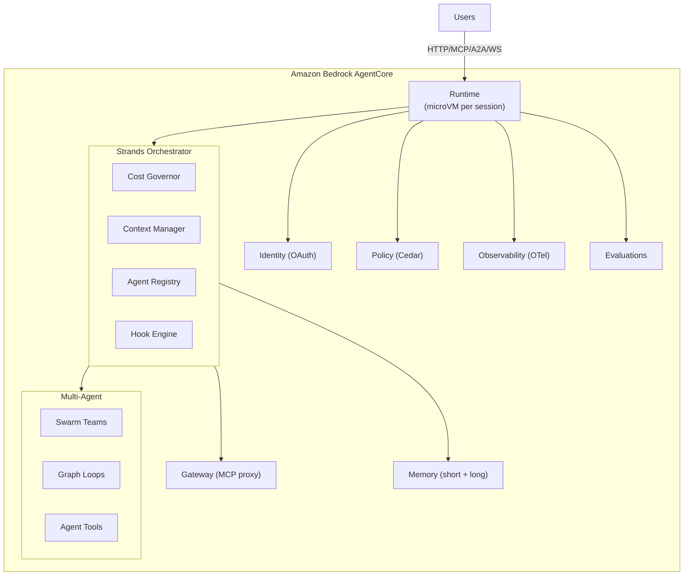
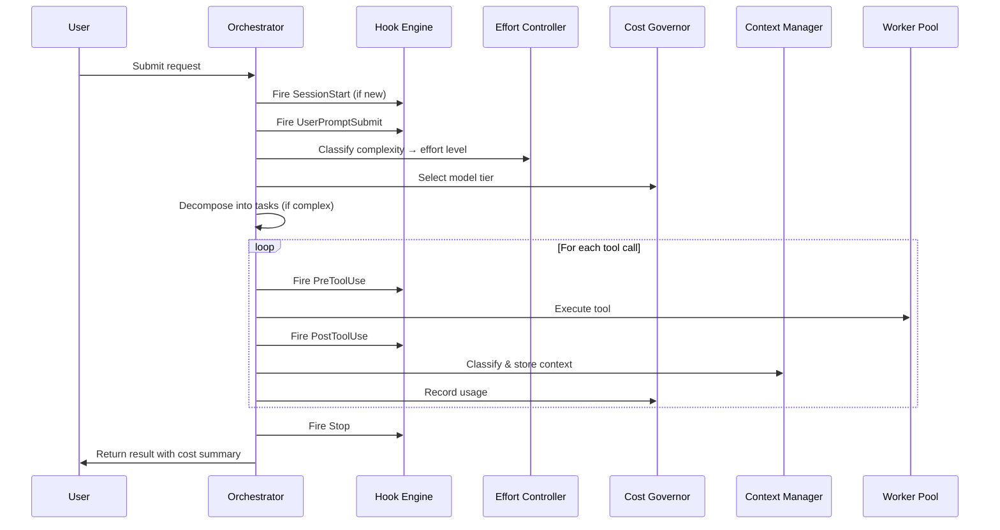

# Design Document: Brainmass v3 Enterprise System

## Overview

The Brainmass v3 Enterprise System is an enterprise-grade agentic coding platform built on the AWS Strands Agents SDK (Python) and Amazon Bedrock AgentCore. It provides a three-tier architecture (Client, Control, Data) with seven core components, three multi-agent topologies, 12 lifecycle hook events, a plugin ecosystem, semantic context management, cost-aware model routing, and flexible deployment options.

The system uses Python as the primary implementation language (Strands SDK is Python-first and production-proven at AWS scale via Amazon Q, Glue, and Kiro). AgentCore provides managed infrastructure (Runtime, Memory, Gateway, Identity, Policy, Observability, Evaluations), reducing custom build effort by ~30-40 hours.

Key design decisions:
- Python (Strands) over TypeScript for mature multi-agent patterns (Graph, Swarm, Workflow)
- AgentCore Memory for persistence + custom semantic triage for intelligent classification
- Both AgentCore Policy (Cedar) AND custom Hook_Engine for comprehensive lifecycle coverage
- Strands Swarm for Agent Teams with custom file-lock protocol for coordination
- AgentCore Runtime for production deployment with microVM isolation per session

## Architecture

### Three-Tier Architecture



### AgentCore Production Deployment



### Model Tier Architecture

| Model | API Identifier | Context Window | Input/M | Output/M | Use Cases |
|-------|---------------|----------------|---------|----------|-----------|
| Opus 4.6 | claude-opus-4-6 | 1M tokens | $5.00 | $25.00 | Complex reasoning, architecture, Agent Team leads |
| Sonnet 4.5 | claude-sonnet-4-5-20250929 | 200K (1M beta) | $3.00 ($6.00 >200K) | $15.00 ($22.50 >200K) | Standard implementation, refactoring, most tasks |
| Haiku 4.5 | claude-haiku-4-5-20251001 | 200K | $0.80 | $4.00 | Search, exploration, linting, prompt hooks |
| Batch API | All tiers | Same | 50% discount | 50% discount | Async non-interactive tasks |

### Request Processing Flow



## Components and Interfaces

### 1. Orchestrator (Control Tier)

The central agent implemented as a Strands `Agent` with `BedrockModel`. Receives user requests, decomposes tasks, selects topologies, manages the hook lifecycle, and tracks costs. Deployed on AgentCore Runtime with `BedrockAgentCoreApp`.

```python
from strands import Agent
from strands.models.bedrock import BedrockModel
from bedrock_agentcore.runtime import BedrockAgentCoreApp

model = BedrockModel(model_id='us.anthropic.claude-opus-4-6-v1:0')

class Orchestrator:
    def __init__(self, context_manager, hook_engine, cost_governor, 
                 effort_controller, agent_registry, config):
        self.agent = Agent(
            model=model,
            system_prompt=SYSTEM_PROMPT,
            tools=[context_manager, cost_governor, agent_registry],
            hooks=[hook_engine]  # Strands HookProvider integration
        )

    async def process_request(self, request: str) -> OrchestratorResult:
        # 8-step flow: hooks → classify → route → decompose → execute → track
        pass

# AgentCore deployment (3 lines to wrap for production):
app = BedrockAgentCoreApp()

@app.entrypoint
async def invoke(payload, session):
    return str(orchestrator.process_request(payload['input']))
```

**Interfaces:**
- `process_request(request: str) -> OrchestratorResult` — Main entry point
- `decompose_task(request: str) -> list[Task]` — Break complex requests into subtasks
- `select_topology(task: Task) -> TopologyType` — Choose subagent/team/loop

### 2. Context Manager (Control Tier)

Extends Strands `SummarizingConversationManager` with semantic triage classification. Uses AgentCore Memory for persistence: short-term (automatic per session) and long-term (semantic strategy for cross-session learning). Manages three storage tiers and context health.

```python
from strands.session import FileSessionManager, SummarizingConversationManager
from bedrock_agentcore.memory import MemoryClient

class ContextManager(SummarizingConversationManager):
    """Extends Strands SummarizingConversationManager with semantic triage."""
    
    def __init__(self, session_id: str):
        super().__init__(max_tokens=100000, summarization_model='haiku')
        # Short-term: Strands SessionManager for conversation history
        self.session_mgr = FileSessionManager(session_id=session_id)
        # Long-term: AgentCore Memory for cross-session learning
        self.memory_client = MemoryClient()

    def classify(self, item: ContextItem) -> ContextCategory:
        # Pattern matching against VERBATIM_PATTERNS, STRUCTURED_PATTERNS
        pass

    def compact(self, window_size: int) -> CompactionResult:
        # Semantic triage: preserve verbatim → session file, compress discussion, drop ephemeral
        pass

    def store_learning(self, pattern: str, resolution: str, confidence: float):
        # Persist to AgentCore Memory long-term with semantic strategy
        self.memory_client.create_memory(
            namespace='learning-store',
            content={'pattern': pattern, 'resolution': resolution, 'confidence': confidence}
        )

    def get_health_metrics(self) -> ContextHealthMetrics:
        # freePercent, totalTokens, preservedTokens, stalenessDistribution, cacheHitRate
        pass
```

**Storage Tiers:**
- Working Memory: In-context conversation (subject to compaction)
- Session File: `.brainmass/session-state.json` (PRESERVE_VERBATIM + PRESERVE_STRUCTURED)
- Learning Store: `.brainmass/learnings/` (cross-session, vector-indexed)

**Classification Patterns:**
- VERBATIM_PATTERNS: stack traces (`Error:.*at\s+`), exit codes, file paths, declarations, test output, version numbers, env variables
- STRUCTURED_PATTERNS: decision records (`DECISION:|TODO:|TASK:`), acceptance criteria, schemas

### 3. Hook Engine (Control Tier / Policy Engine)

Implements Strands `HookProvider` with 12 lifecycle events and 3 handler types. Combines with AgentCore Policy (Cedar) for production governance.

The Strands SDK provides `HookProvider` with `register_hooks(registry: HookRegistry)` and callback registration via `registry.add_callback(EventType, handler)`. The v3 system extends this with 12 custom events (vs Strands' native `BeforeToolCallEvent` and `AfterToolCallEvent`), 3 handler types, and 7 configuration scopes.

AgentCore Policy (Cedar language) provides production-grade governance at the Gateway level, outside the agent's reasoning loop. The custom Hook_Engine operates inside the agent loop with more granular events (PreCompact, SubagentStop, prompt-type handlers) that Cedar cannot see.

```python
from strands.hooks import HookProvider, HookRegistry
from strands.hooks import BeforeToolCallEvent, AfterToolCallEvent

class BrainmassHookEngine(HookProvider):
    """Extends Strands HookProvider with 12 lifecycle events and 3 handler types."""
    
    def register_hooks(self, registry: HookRegistry):
        # Map Strands native events to our PreToolUse/PostToolUse
        registry.add_callback(BeforeToolCallEvent, self._handle_pre_tool_use)
        registry.add_callback(AfterToolCallEvent, self._handle_post_tool_use)

    def _handle_pre_tool_use(self, event: BeforeToolCallEvent):
        # Execute all matching PreToolUse handlers across all scopes
        # Returns allow/deny/modify based on handler results
        pass

    def _handle_post_tool_use(self, event: AfterToolCallEvent):
        # Execute all matching PostToolUse handlers
        pass

    # Custom events not in Strands native (fired by Orchestrator directly):
    async def fire(self, event: HookEvent, context: HookContext) -> HookResult:
        # SessionStart, UserPromptSubmit, PreCompact, Stop, SubagentStop, etc.
        pass

    def register_scoped(self, hooks: dict, scope_id: str) -> callable:
        # Returns cleanup function for agent-scoped hooks
        pass
```

**Handler Types:**
- Command: Shell script via `subprocess.run()`, JSON stdin, exit 0/2, 10-min timeout
- Prompt: Haiku single-turn evaluation via `Agent(model=haiku_model)(prompt)` with $ARGUMENTS
- Agent: Sub-agent via `Agent(tools=[read_file, grep, glob])(context)` for multi-turn verification

**Scope Precedence:** Enterprise managed > Plugin > Subagent frontmatter > Skill frontmatter > Project-local > Project-shared > User-wide

**AgentCore Policy (Cedar) — production governance at Gateway level:**
```cedar
# Block destructive operations on production resources
permit(principal, action == AgentCore::Action::"delete_s3_bucket",
  resource) when { !(context.input.bucket_name like "*prod*") };
```

### 4. Cost Governor (Control Tier)

Custom model selection wrapping Strands `BedrockModel` instances. Enforces budgets, routes to cheapest capable model, tracks costs.

```python
class CostGovernor:
    MODELS = {
        'haiku':  BedrockModel(model_id='us.anthropic.claude-haiku-4-5-v1:0'),
        'sonnet': BedrockModel(model_id='us.anthropic.claude-sonnet-4-5-v1:0'),
        'opus':   BedrockModel(model_id='us.anthropic.claude-opus-4-6-v1:0'),
    }

    def select_model(self, signals: TaskSignals, budget: AgentBudget) -> ModelTier:
        if budget.status == 'critical': return 'haiku'
        if budget.status == 'warning': return downgrade_one_tier(current)
        if signals.is_exploration or (signals.files_affected <= 1 and not signals.requires_reasoning):
            return 'haiku'
        if signals.is_team_lead or signals.requires_reasoning or signals.dependency_depth > 3:
            return 'opus'
        return 'sonnet'

    def record_usage(self, agent_id, input_tokens, output_tokens, model, cached):
        pass

    def check_budget(self, agent_id) -> BudgetStatus:
        # 'ok' | 'warning' (80%) | 'critical' (95%) | 'exceeded' (100%)
        pass
```

### 5. Worker Pool (Data Tier)

Manages three multi-agent topologies using Strands primitives. Each topology maps to a specific Strands SDK pattern.

**Hierarchical Subagents** — `Agent.as_tool()` or `@tool` wrapping an Agent:
```python
from strands import Agent, tool
from strands.models.bedrock import BedrockModel

reviewer = Agent(
    name='code-reviewer',
    model=BedrockModel(model_id='us.anthropic.claude-sonnet-4-5-v1:0'),
    system_prompt='You are a senior code reviewer...',
    tools=[read_file, grep, glob]
)

# Option 1: Agent.as_tool() — direct wrapping
orchestrator = Agent(tools=[reviewer.as_tool(), implementer.as_tool()])

# Option 2: @tool decorator — custom wrapping with logic
@tool
def review_code(task: str) -> str:
    '''Review code for quality and security issues.'''
    return str(reviewer(task))
```

**Agent Teams** — `Swarm` + custom file-lock protocol + `invocation_state` for shared context:
```python
from strands.multiagent import Swarm

class TeamManager:
    def spawn_team(self, lead_config, teammate_configs, task_list) -> TeamResult:
        teammates = [self._create_agent(cfg) for cfg in teammate_configs]
        team = Swarm(teammates)
        # Swarm provides shared context and collaborative handoffs
        result = team.execute(task_list.to_prompt())
        # Custom file-lock protocol for file coordination
        # Custom mailbox IPC via filesystem JSON messages
        return result
```

**Self-Improving Loops** — `GraphBuilder` with conditional edges:
```python
from strands.multiagent import GraphBuilder

builder = GraphBuilder()
builder.add_node(implementer, 'implement')
builder.add_node(tester, 'test')
builder.add_node(reviewer, 'review')
builder.add_edge('implement', 'test')
builder.add_edge('test', 'review')
builder.add_conditional_edge('review', lambda r: 'implement' if 'FAIL' in r else 'END')
graph = builder.build()
result = graph('Implement user authentication with JWT')
```

**Pipeline (Compound Loops)** — `Workflow` or `Graph` for sequential stages:
```python
from strands.multiagent import Workflow

pipeline = Workflow([analysis_agent, planning_agent, execution_agent])
# Each stage's output becomes the next stage's input
result = pipeline.execute('Build the authentication module')
```

### 6. Agent Registry (Control Tier)

Custom loader parsing `.md` files with YAML frontmatter (using `python-frontmatter` library) into Strands `Agent` objects. Each agent becomes a tool via `Agent.as_tool()` or the `@tool` decorator.

```python
import frontmatter  # pip install python-frontmatter
from strands import Agent
from strands.models.bedrock import BedrockModel

MODEL_MAP = {
    'sonnet': BedrockModel(model_id='us.anthropic.claude-sonnet-4-5-v1:0'),
    'opus': BedrockModel(model_id='us.anthropic.claude-opus-4-6-v1:0'),
    'haiku': BedrockModel(model_id='us.anthropic.claude-haiku-4-5-v1:0'),
}

class AgentLoader:
    def load_agent_file(self, filepath: str) -> AgentDefinition:
        post = frontmatter.load(filepath)
        fm = post.metadata
        body = post.content
        # Validate required fields (name, description)
        # Normalize tools (comma-separated → list)
        # Resolve model alias via MODEL_MAP
        # Parse hooks into HookDefinition structures
        return AgentDefinition(name=fm['name'], ..., system_prompt=body.strip())

    def to_strands_agent(self, agent_def: AgentDefinition) -> Agent:
        """Convert AgentDefinition to a Strands Agent object."""
        model = MODEL_MAP.get(agent_def.model, MODEL_MAP['sonnet'])
        tools = self._resolve_tools(agent_def.tools)
        hooks = [self._build_hook_provider(agent_def.hooks)] if agent_def.hooks else []
        return Agent(
            name=agent_def.name,
            model=model,
            system_prompt=agent_def.system_prompt,
            tools=tools,
            hooks=hooks
        )

class AgentRegistry:
    async def load_all(self) -> None:
        # Load from: plugin → user → project (precedence order)
        pass

    def get(self, name: str) -> AgentDefinition | None:
        pass

    def get_tool_definitions(self) -> list[ToolDefinition]:
        # Each agent becomes a tool: name='agent:{name}', description=agent.description
        pass

class AgentRunner:
    async def execute(self, agent_def: AgentDefinition, task: str) -> AgentResult:
        # 13-step lifecycle: dispatch → resolve → tools → MCP → skills → hooks → 
        # context → system → loop → stop → cleanup → release → return
        agent = self.loader.to_strands_agent(agent_def)
        result = agent(task)  # Execute via Strands Agent
        return AgentResult(agent_name=agent_def.name, summary=str(result), ...)
```

### 7. Plugin Registry (Client Tier)

Manages plugin lifecycle: discovery, installation, capability registration, marketplace integration.

```python
class PluginRegistry:
    def add_marketplace(self, owner_repo: str) -> None:
        pass

    def install(self, plugin_name: str, marketplace: str) -> None:
        # Download, validate manifest, register capabilities
        pass

    def register_capabilities(self, plugin: PluginManifest) -> None:
        # Register commands, agents, skills, hooks, MCP servers, LSP servers
        pass
```

### 8. Supporting Components

**Effort Controller:**
```python
class EffortController:
    def select_effort(self, signals: TaskSignals, model: ModelTier, budget: AgentBudget) -> EffortLevel:
        # Quick (2000 tokens), Standard (10000), Deep (50000+)
        pass
```

**Cache Manager:**
```python
class CacheManager:
    def inject_cache_controls(self, request: MessagesRequest) -> MessagesRequest:
        # Add cache_control blocks to stable layers (system, BRAINMASS.md, tools)
        pass

    def track_hit_rate(self, usage: Usage) -> float:
        pass
```

**Session Teleporter:**
```python
from strands.session import SessionManager

class SessionTeleporter:
    def __init__(self):
        # Uses Strands SessionManager with S3 backend for cross-surface persistence
        self.session_mgr = SessionManager(storage='s3', bucket='brainmass-sessions')

    def serialize(self, session: Session) -> bytes:
        # All state → portable blob via Strands SessionManager + S3
        pass

    def deserialize(self, blob: bytes) -> Session:
        pass
```

**Quota Manager:**
```python
class QuotaManager:
    def track_usage(self, surface: str, agent_id: str, tokens: int, cost: float):
        # Track across all Brainmass surfaces (web, mobile, desktop, CLI)
        pass

    def predict_exhaustion(self) -> datetime | None:
        # Based on current run rate
        pass

    def consume_rate_limit_info(self, event: dict):
        # Process SDKRateLimitInfo events for utilization, reset times, overage
        pass
```

**Learning Store:**
```python
from bedrock_agentcore.memory import MemoryClient

class LearningStore:
    def __init__(self):
        # Uses AgentCore Memory long-term with semantic strategy
        self.memory_client = MemoryClient()

    def add_learning(self, pattern: str, resolution: str, confidence: float, iteration: int):
        self.memory_client.create_memory(
            namespace='learning-store',
            content={'pattern': pattern, 'resolution': resolution, 
                     'confidence': confidence, 'iteration': iteration}
        )

    def query_relevant(self, task_description: str, top_k: int = 5) -> list[Learning]:
        # Vector similarity search using AgentCore Memory semantic strategy
        pass
```

**Observability:**
```python
from strands.telemetry import get_tracer

tracer = get_tracer('brainmass-v3')

# All agent actions emit OTel spans with custom attributes
with tracer.start_as_current_span('agent-execution') as span:
    span.set_attribute('agent.name', agent.name)
    span.set_attribute('model.id', model.model_id)
    span.set_attribute('effort_level', 'standard')
    span.set_attribute('cost_usd', 0.045)
    span.set_attribute('fast_mode', False)
    result = agent(task)
    span.set_attribute('tokens.input', result.usage.input_tokens)
    span.set_attribute('tokens.output', result.usage.output_tokens)
# AgentCore Observability provides CloudWatch dashboards automatically
```

**Security (Bedrock Guardrails):**
```python
# Integrate Bedrock Guardrails via Strands Agent configuration
agent = Agent(
    model=BedrockModel(model_id='us.anthropic.claude-sonnet-4-5-v1:0'),
    guardrail_id='your-guardrail-id',
    guardrail_version='DRAFT',
)
# AgentCore Identity for auth (Okta, Entra, Cognito)
# AgentCore Policy (Cedar) for tool-level governance at Gateway
```

## Data Models

### Core Types

```python
from enum import Enum
from dataclasses import dataclass, field
from datetime import datetime
from typing import Optional

class ModelTier(Enum):
    OPUS = 'opus'
    SONNET = 'sonnet'
    HAIKU = 'haiku'

class EffortLevel(Enum):
    QUICK = 'quick'      # budget_tokens: 2000
    STANDARD = 'standard' # budget_tokens: 10000
    DEEP = 'deep'         # budget_tokens: 50000+

class ContextCategory(Enum):
    PRESERVE_VERBATIM = 'PRESERVE_VERBATIM'
    PRESERVE_STRUCTURED = 'PRESERVE_STRUCTURED'
    COMPRESS_AGGRESSIVE = 'COMPRESS_AGGRESSIVE'
    EPHEMERAL = 'EPHEMERAL'

class HookEvent(Enum):
    SESSION_START = 'SessionStart'
    USER_PROMPT_SUBMIT = 'UserPromptSubmit'
    PRE_TOOL_USE = 'PreToolUse'
    POST_TOOL_USE = 'PostToolUse'
    POST_TOOL_USE_FAILURE = 'PostToolUseFailure'
    PERMISSION_REQUEST = 'PermissionRequest'
    PRE_COMPACT = 'PreCompact'
    NOTIFICATION = 'Notification'
    STOP = 'Stop'
    SUBAGENT_STOP = 'SubagentStop'
    SESSION_END = 'SessionEnd'
    SETUP = 'Setup'

class HookHandlerType(Enum):
    COMMAND = 'command'
    PROMPT = 'prompt'
    AGENT = 'agent'

class BudgetStatus(Enum):
    OK = 'ok'
    WARNING = 'warning'   # 80%
    CRITICAL = 'critical' # 95%
    EXCEEDED = 'exceeded'  # 100%

class TopologyType(Enum):
    HIERARCHICAL = 'hierarchical'
    AGENT_TEAMS = 'agent_teams'
    SELF_IMPROVING_LOOP = 'self_improving_loop'
    PIPELINE = 'pipeline'
```

### Context and Session Models

```python
@dataclass
class ContextItem:
    id: str
    category: ContextCategory
    content: str
    token_count: int
    created_at: datetime
    last_referenced_at: datetime
    reference_count: int
    source: str  # 'user' | 'assistant' | 'tool_call' | 'tool_result' | 'system'
    staleness_score: float = 0.0  # (turns_since_ref) * (1 / reference_count)

@dataclass
class ContextHealthMetrics:
    free_percent: float
    total_tokens: int
    preserved_tokens: int
    compressible_tokens: int
    ephemeral_tokens: int
    staleness_distribution: dict[str, int]
    cache_hit_rate: float

@dataclass
class AgentBudget:
    input_budget_tokens: int
    output_budget_tokens: int
    session_budget_usd: float
    team_budget_usd: Optional[float] = None
    current_input_tokens: int = 0
    current_output_tokens: int = 0
    current_cost_usd: float = 0.0

    @property
    def status(self) -> BudgetStatus:
        pct = self.current_cost_usd / self.session_budget_usd if self.session_budget_usd > 0 else 0
        if pct >= 1.0: return BudgetStatus.EXCEEDED
        if pct >= 0.95: return BudgetStatus.CRITICAL
        if pct >= 0.80: return BudgetStatus.WARNING
        return BudgetStatus.OK
```

### Hook Models

```python
@dataclass
class HookHandler:
    type: HookHandlerType
    command: Optional[str] = None    # for 'command' type
    prompt: Optional[str] = None     # for 'prompt' type
    agent_config: Optional[dict] = None  # for 'agent' type
    is_async: bool = False
    timeout: int = 600000  # 10 minutes in ms

@dataclass
class HookDefinition:
    matcher: Optional[str] = None  # regex, '*' = match all
    hooks: list[HookHandler] = field(default_factory=list)

@dataclass
class HookContext:
    session_id: str
    hook_event_name: HookEvent
    cwd: str
    session_type: str  # 'interactive' | 'headless'
    tool_name: Optional[str] = None
    tool_input: Optional[dict] = None
    tool_response: Optional[str] = None
    source: Optional[str] = None  # for SessionStart: 'new' | 'resume' | 'teleport'
    model: Optional[str] = None

@dataclass
class HookResult:
    permission_decision: Optional[str] = None  # 'allow' | 'deny'
    permission_decision_reason: Optional[str] = None
    updated_input: Optional[dict] = None
    additional_context: Optional[str] = None
    decision: Optional[str] = None  # 'block' | 'continue' (for Stop event)
    reason: Optional[str] = None
```

### Agent Models

```python
@dataclass
class AgentDefinition:
    name: str                    # lowercase-with-hyphens
    description: str             # action-oriented with examples
    model: str = 'inherit'       # sonnet | opus | haiku | inherit
    tools: Optional[list[str]] = None
    disallowed_tools: Optional[list[str]] = None
    permission_mode: str = 'default'  # default | bypassPermissions | plan
    color: Optional[str] = None
    max_turns: Optional[int] = None
    hooks: dict[str, list[HookDefinition]] = field(default_factory=dict)
    skills: list[str] = field(default_factory=list)
    mcp_servers: dict[str, dict] = field(default_factory=dict)
    memory: Optional[str] = None
    system_prompt: str = ''
    source: str = 'project'      # project | user | plugin | cli
    plugin_namespace: Optional[str] = None
    file_path: str = ''

@dataclass
class AgentResult:
    agent_name: str
    summary: str
    turns_used: int
    tokens_consumed: dict  # {input, output, cache_read}
    tools_used: list[str]
    files_modified: list[str]
    exit_reason: str  # 'complete' | 'maxTurns' | 'budget' | 'error' | 'stopped'
```

### Team and Loop Models

```python
@dataclass
class TeamTask:
    id: str
    title: str
    assignee: Optional[str]
    status: str  # 'pending' | 'claimed' | 'blocked' | 'complete'
    dependencies: list[str]
    files: list[str]

@dataclass
class MailboxMessage:
    sender: str
    recipient: str
    type: str  # 'task_assignment' | 'finding' | 'question' | 'status_update'
    payload: dict
    timestamp: datetime

@dataclass
class LoopContext:
    current_task: str
    acceptance_criteria: list[str]
    constraints: list[str]
    learnings: list[dict]  # {pattern, resolution, confidence, source_iteration}
    failed_approaches: list[dict]  # {iteration, approach, why_failed}
    iteration_count: int
    max_iterations: int

@dataclass
class Learning:
    pattern: str
    resolution: str
    confidence: float
    source_iteration: int
    embedding: Optional[list[float]] = None
```

### Plugin and Skill Models

```python
@dataclass
class PluginManifest:
    name: str
    description: str
    version: str
    author: dict  # {name: str}
    homepage: Optional[str] = None
    license: Optional[str] = None

@dataclass
class SkillDefinition:
    name: str
    description: str
    disable_model_invocation: bool = False
    hooks: dict[str, list[HookDefinition]] = field(default_factory=dict)
    allowed_tools: Optional[list[str]] = None
    content: str = ''  # SKILL.md body

@dataclass
class ModelPricing:
    input_per_million: float
    output_per_million: float
    cached_input_per_million: float
    cache_write_per_million: float

PRICING: dict[ModelTier, ModelPricing] = {
    ModelTier.OPUS: ModelPricing(5.00, 25.00, 0.50, 6.25),
    ModelTier.SONNET: ModelPricing(3.00, 15.00, 0.30, 3.75),
    ModelTier.HAIKU: ModelPricing(0.80, 4.00, 0.08, 1.00),
}
```

### Configuration Models

```python
@dataclass
class McpServerConfig:
    command: str
    args: list[str] = field(default_factory=list)
    env: dict[str, str] = field(default_factory=dict)
    scope: str = 'project'  # 'project' | 'user'

@dataclass
class SessionState:
    conversation_history: list[dict]
    tool_permissions: dict[str, bool]
    active_workers: list[str]
    pending_approvals: list[dict]
    compaction_state: dict
    context_manager_state: dict
    cost_tracking: dict
    hook_registrations: dict
    trace_id: str
```

## Correctness Properties

*A property is a characteristic or behavior that should hold true across all valid executions of a system — essentially, a formal statement about what the system should do. Properties serve as the bridge between human-readable specifications and machine-verifiable correctness guarantees.*

### Property 1: Context classification is exhaustive and exclusive
*For any* context item (text content from any source), the Context_Manager SHALL classify it into exactly one of the four categories (PRESERVE_VERBATIM, PRESERVE_STRUCTURED, COMPRESS_AGGRESSIVE, EPHEMERAL), and the classification should be deterministic (same input always produces same category).
**Validates: Requirements 2.1**

### Property 2: PRESERVE_VERBATIM items survive compaction
*For any* set of context items where some are classified as PRESERVE_VERBATIM, after compaction (at any threshold — 83.5% for 200K or 85% for 1M), all PRESERVE_VERBATIM items SHALL be present in the session file with 100% content fidelity (byte-for-byte identical).
**Validates: Requirements 2.4, 2.5, 2.11**

### Property 3: Staleness score correctness
*For any* context item with a known reference history (turns since last reference, reference count), the computed staleness score SHALL equal (turns_since_last_reference) × (1 / reference_count).
**Validates: Requirements 2.7**

### Property 4: Context health metrics consistency
*For any* context state, the sum of preservedTokens + compressibleTokens + ephemeralTokens SHALL equal totalTokens - system overhead, and freePercent SHALL equal (1 - totalTokens / windowSize) × 100.
**Validates: Requirements 2.8**

### Property 5: Hook matcher regex correctness
*For any* tool name and matcher regex pattern, the Hook_Engine SHALL correctly match or not match according to standard regex semantics, with '*' and omitted matchers matching all tool names.
**Validates: Requirements 3.8**

### Property 6: PreToolUse hook allow/deny/modify
*For any* PreToolUse hook execution, if the handler returns exit code 0 the tool SHALL execute, if exit code 2 or deny decision the tool SHALL NOT execute, and if updatedInput is provided the tool SHALL execute with the modified input (original input replaced transparently).
**Validates: Requirements 3.4**

### Property 7: Async hooks do not block execution
*For any* hook marked as async (async: true), the main execution flow SHALL complete without waiting for the async hook to finish, and the async hook's result SHALL be logged to OpenTelemetry.
**Validates: Requirements 3.7**

### Property 8: Cost calculation correctness
*For any* API call with known input tokens, output tokens, cache read tokens, cache write tokens, and model tier, the calculated cost SHALL equal: (regularInput/1M × inputRate) + (output/1M × outputRate) + (cacheRead/1M × cachedRate) + (cacheWrite/1M × cacheWriteRate), with Batch API calls at exactly 50% of base rates.
**Validates: Requirements 4.6, 1.5**

### Property 9: Budget status thresholds
*For any* agent budget state, the budget status SHALL be: OK when utilization < 80%, WARNING when 80% ≤ utilization < 95%, CRITICAL when 95% ≤ utilization < 100%, EXCEEDED when utilization ≥ 100%. At WARNING, the model SHALL be downgraded one tier. At CRITICAL, the agent SHALL pause.
**Validates: Requirements 4.2, 4.3**

### Property 10: Model selection from TaskSignals
*For any* combination of TaskSignals (isExploration, filesAffected, requiresReasoning, isTeamLead, dependencyDepth), the Cost_Governor SHALL select: Haiku when isExploration=true OR (filesAffected≤1 AND !requiresReasoning), Opus when isTeamLead=true OR requiresReasoning=true OR dependencyDepth>3, Sonnet otherwise. Budget overrides SHALL downgrade one tier at WARNING and force Haiku at CRITICAL.
**Validates: Requirements 4.5**

### Property 11: File-lock mutual exclusion
*For any* set of concurrent file access attempts by different teammates, at most one teammate SHALL hold the lock for a given file at any time. Stale locks (>5 minutes) SHALL be breakable.
**Validates: Requirements 6.4**

### Property 12: Loop iteration context isolation
*For any* self-improving loop iteration, the agent's context window SHALL contain only the structured context file contents and system prompt — no conversation history from previous iterations SHALL be present.
**Validates: Requirements 7.1**

### Property 13: Loop context file round-trip
*For any* valid LoopContext object, serializing to JSON at .brainmass/loop-context.json and then deserializing SHALL produce an equivalent LoopContext object with all fields preserved (currentTask, acceptanceCriteria, constraints, learnings, failedApproaches, iterationCount, maxIterations).
**Validates: Requirements 7.2**

### Property 14: Agent definition parsing round-trip
*For any* valid .md file with YAML frontmatter conforming to the agent schema, parsing into an AgentDefinition and then serializing back to YAML frontmatter + Markdown body SHALL produce a semantically equivalent agent definition (all fields preserved).
**Validates: Requirements 8.1**

### Property 15: Agent definition validation
*For any* agent definition, validation SHALL accept definitions with valid required fields (name matching ^[a-z][a-z0-9-]*$, non-empty description) and valid optional field values (model in {sonnet, opus, haiku, inherit}, tools XOR disallowedTools not both), and SHALL reject invalid definitions with descriptive error messages.
**Validates: Requirements 8.2, 8.8**

### Property 16: Model alias resolution
*For any* model alias string, resolution SHALL produce: 'sonnet' → 'claude-sonnet-4-5-20250929', 'opus' → 'claude-opus-4-6', 'haiku' → 'claude-haiku-4-5-20251001', 'inherit' → parent's model (or 'claude-sonnet-4-5-20250929' if no parent).
**Validates: Requirements 8.4**

### Property 17: Agent precedence resolution
*For any* set of agents loaded from multiple storage locations where agents share the same name, the agent from the highest-precedence location SHALL be returned: project > user > plugin. Plugin agents with namespace prefixes SHALL never collide with project/user agents.
**Validates: Requirements 8.5**

### Property 18: Session serialization round-trip
*For any* valid session state (conversation history, tool permissions, active workers, pending approvals, compaction state, cost tracking, hook registrations, trace ID), serializing to a portable blob and deserializing SHALL produce an equivalent session state with all fields preserved.
**Validates: Requirements 13.1**

### Property 19: Effort level selection
*For any* combination of task complexity signals, model capability, and budget constraints, the Effort_Controller SHALL select the correct effort level (Quick/Standard/Deep) with the correct budget_tokens mapping (2000/10000/50000+), respecting model constraints (Haiku always Quick, Sonnet Quick or Standard, Opus any level) and budget downgrades.
**Validates: Requirements 12.1, 12.2**

### Property 20: Cache layer duration assignment
*For any* content type in the 7-layer caching strategy, the Cache_Manager SHALL assign the correct cache duration: 1-hour for system prompts, BRAINMASS.md, and tool schemas; 5-minute for policy/hook definitions and skill instructions; never-cache for conversation history and current diff state.
**Validates: Requirements 11.1**

### Property 21: Learning store semantic retrieval
*For any* learning entry stored with a vector embedding, querying with a semantically similar task description SHALL return that entry in the top-K results, and querying with an unrelated task description SHALL NOT return it in the top-K results.
**Validates: Requirements 21.2**

### Property 22: API request schema conformance
*For any* valid set of request parameters (model, max_tokens, messages, system, tools, thinking), the formatted Anthropic Messages API request SHALL conform to the schema with all required fields present and correctly typed.
**Validates: Requirements 28.1**

## Error Handling

### Model API Errors
- Rate limit exceeded: Back off exponentially, consume SDKRateLimitInfo events for reset times, alert via Quota_Manager
- Context window exceeded: Trigger emergency compaction (COMPRESS_AGGRESSIVE on all non-VERBATIM items), downgrade to smaller model if needed
- Model unavailable: Fall back to next available tier (Opus → Sonnet → Haiku), log degradation to OTel
- Malformed response: Retry up to 3 times with exponential backoff, log to OTel, return error to user if all retries fail

### Hook Execution Errors
- Command handler timeout (>10 min): Kill process, log timeout to OTel, treat as allow (fail-open for non-blocking events, fail-closed for PreToolUse)
- Command handler crash: Log error, treat as allow for non-blocking events
- Prompt handler model failure: Fall back to allow, log degradation
- Agent handler failure: Log error, return partial result if available
- Async hook failure: Log to OTel only, never block main execution

### Agent Execution Errors
- maxTurns exceeded: Graceful stop with summary of work completed so far
- Budget exceeded: Pause agent, request human approval, downgrade model if approved
- Tool execution failure: Fire PostToolUseFailure hook, log error, let model decide next action
- MCP server startup failure: Log error, continue without that server's tools, notify user
- Agent definition parse error: Log descriptive error, skip invalid agent, continue loading others

### Multi-Agent Errors
- File lock contention: Wait up to 30 seconds, break stale locks (>5 min), log conflict to team coordination trace
- Mailbox delivery failure: Retry 3 times, log to team coordination trace, alert team lead
- Git merge conflict: Attempt auto-resolution, if fails notify team lead for manual resolution
- Loop safety trigger: Auto-pause loop, preserve current state, notify user with reason (error repetition, diff size, stop file)
- Teammate crash: Log to team coordination trace, reassign tasks to remaining teammates

### Session and Context Errors
- Session serialization failure: Log error, offer to save partial state, maintain audit trail
- Teleport conflict (simultaneous edits): Apply last-write-wins, notify all surfaces of conflict
- Learning store corruption: Fall back to empty learnings, log error, attempt recovery from backup
- Compaction data loss: Should never happen for PRESERVE_VERBATIM items (this is a critical invariant); if detected, halt and alert

### Security Errors
- Nest guard detection: Refuse to start, display clear error message
- PII/PHI detection in output: Redact before returning to user, log classification event
- Guardrail violation: Block response, return sanitized error, log to audit trail
- Cedar policy denial: Return structured denial with reason, log to Gateway metrics

## Testing Strategy

### Dual Testing Approach

The system uses both unit tests and property-based tests for comprehensive coverage:

- **Unit tests** (pytest): Specific examples, edge cases, error conditions, integration points
- **Property-based tests** (Hypothesis): Universal properties across all valid inputs, minimum 100 iterations per property

### Property-Based Testing Configuration

- Library: **Hypothesis** (Python PBT library)
- Minimum iterations: 100 per property test
- Each property test references its design document property
- Tag format: **Feature: claude-code-v3-enterprise, Property {number}: {property_text}**
- Each correctness property is implemented by a SINGLE property-based test

### Test Organization

```
tests/
├── unit/
│   ├── test_context_manager.py      # Classification examples, edge cases
│   ├── test_hook_engine.py          # Event firing, handler execution
│   ├── test_cost_governor.py        # Pricing examples, budget edge cases
│   ├── test_agent_registry.py       # Loading, validation, precedence
│   ├── test_agent_loader.py         # YAML parsing, field normalization
│   ├── test_team_manager.py         # Lock protocol, mailbox delivery
│   ├── test_loop_runner.py          # Safety controls, context file
│   ├── test_cache_manager.py        # Layer assignment, hit rate
│   ├── test_effort_controller.py    # Level selection, budget_tokens mapping
│   ├── test_session_teleporter.py   # Serialization, conflict resolution
│   ├── test_plugin_registry.py      # Install, uninstall, capability registration
│   ├── test_skill_registry.py       # Discovery, invocation, hot-reload
│   ├── test_quota_manager.py        # Usage tracking, prediction
│   └── test_security.py             # Data classification, nest guard
├── property/
│   ├── test_context_properties.py   # Properties 1-4
│   ├── test_hook_properties.py      # Properties 5-7
│   ├── test_cost_properties.py      # Properties 8-10
│   ├── test_agent_properties.py     # Properties 14-17
│   ├── test_team_properties.py      # Property 11
│   ├── test_loop_properties.py      # Properties 12-13
│   ├── test_session_properties.py   # Property 18
│   ├── test_effort_properties.py    # Property 19
│   ├── test_cache_properties.py     # Property 20
│   ├── test_learning_properties.py  # Property 21
│   └── test_api_properties.py       # Property 22
└── evals/
    ├── task_completion.py           # ≥90% acceptance criteria verification
    ├── code_quality.py              # ≥4.0/5.0 LLM-as-a-Judge
    ├── safety.py                    # Zero critical violations
    ├── context_preservation.py      # ≥95% verbatim survival
    ├── cost_efficiency.py           # ≤20% budget variance
    ├── coordination.py              # ≤85% overhead ratio
    ├── learning_retention.py        # No repeated mistakes
    └── latency.py                   # p95 ≤30s
```

### Unit Test Focus Areas

- Specific classification examples (known error messages → PRESERVE_VERBATIM, known discussion → COMPRESS_AGGRESSIVE)
- Hook event firing order in integration scenarios
- Budget threshold edge cases (exactly 80%, exactly 95%, exactly 100%)
- Agent definition validation with specific invalid inputs (missing name, both tools and disallowedTools)
- File lock race condition scenarios
- Loop safety control triggers (3+ same errors, diff size exceeded, stop file present)
- Session teleport with active workers
- Plugin install/uninstall lifecycle
- Nest guard detection

### Property Test Focus Areas

- Context classification exhaustiveness and determinism (Property 1)
- PRESERVE_VERBATIM compaction survival (Property 2)
- Cost calculation arithmetic correctness (Property 8)
- Model selection rule coverage (Property 10)
- Agent definition round-trip parsing (Property 14)
- Session serialization round-trip (Property 18)
- Learning store semantic retrieval relevance (Property 21)

### Evaluation Suite (Strands Evals SDK)

- Uses Strands Evals SDK 0.1.2 with LLM-as-a-Judge and ActorSimulator
- Integrates with AgentCore Evaluations (13 built-in + custom)
- Supports on-demand evaluation during development and continuous online evaluation in production
- 8 evaluation dimensions with specific targets and methods as defined in Requirement 17
